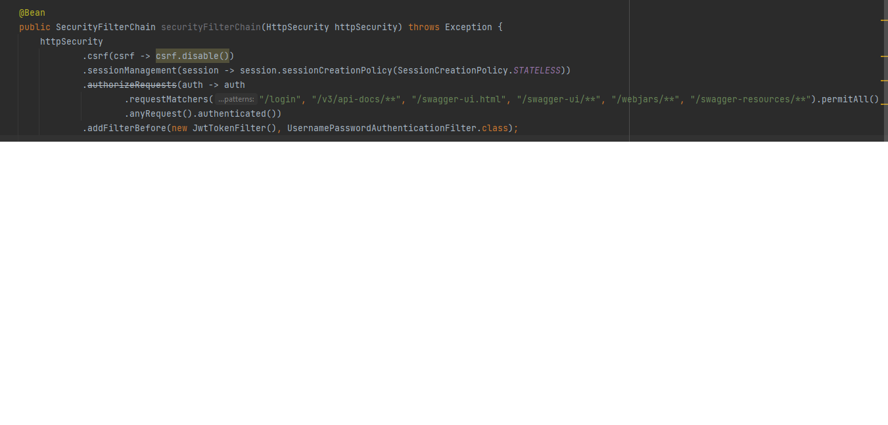
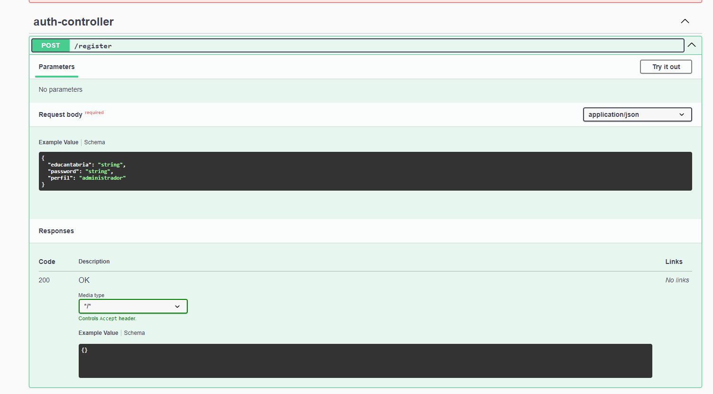
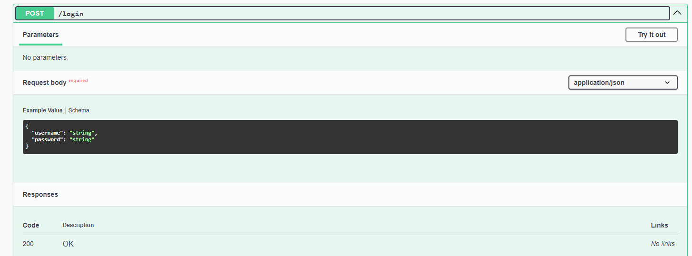

# Tabla de Contenidos
1. [Introducción](#introducción)
2. [Características Principales de la API](#características-principales-de-la-api)
3. [Estructura de Capas del Proyecto](#estructura-de-capas-del-proyecto)
   - [Capa de Controladores (Controllers)](#capa-de-controladores-controllers)
   - [Capa de Transferencia de Datos (dto)](#capa-de-transferencia-de-datos-dto)
   - [Capa de Enumeraciones (enums)](#capa-de-enumeraciones-enums)
   - [Capa de Modelos (models)](#capa-de-modelos-models)
   - [Capa de Repositorios (repositories)](#capa-de-repositorios-repositories)
   - [Capa de Seguridad (security)](#capa-de-seguridad-security)
   - [Capa de Servicios (services)](#capa-de-servicios-services)
   - [Capa de Recursos (resources)](#capa-de-recursos-resources)
4. [Restricciones de Acceso](#restricciones-de-acceso)
5. [Registro y Logeo](#registro-y-logeo)
6. [Autenticación y Autorización con JWT](#autenticación-y-autorización-con-jwt)
7. [ENDPOINTS](#endpoints)
   - [Descripción General de los Métodos HTTP](#descripción-general-de-los-métodos-http)
   - [Parámetros](#parámetros)
   - [Cuerpo de la Solicitud](#cuerpo-de-la-solicitud)
8. [Acceso a SWAGGER](#acceso-a-swagger)
9. [Capa controllers](#capa-controllers)
10. [Capa dto](#capa-dto)
11. [Capa enums](#capa-enums)
12. [Capa models](#capa-models)
13. [Capa repositories](#capa-repositories)
14. [Capa security](#capa-security)
15. [Capa services](#capa-services)
16. [Main: RetoApplication](#main-retoapplication)
17. [resources/application.properties](#resourcesapplicationproperties)

# Introducción a la Documentación de la API para la Gestión de Incidencias del Centro Educativo

Bienvenidos a la documentación de nuestra API desarrollada específicamente para el departamento TIC del IES Miguel Herrero Pereda. Esta API forma parte de un ecosistema de software diseñado para mejorar y automatizar la gestión de incidencias relacionadas con el funcionamiento de equipos, software y cuentas de servicios de usuarios dentro del centro. Nuestro objetivo es proporcionar una herramienta eficiente y segura que facilite la comunicación y el seguimiento de estas incidencias entre el profesorado y el equipo administrativo TIC.

El desarrollo de esta API responde a la necesidad de un sistema centralizado que no solo permita a los profesores reportar fallos de manera sencilla sino también seguir el progreso de sus soluciones, recibiendo notificaciones sobre los avances. Además, ofrece a los profesores administradores TIC la capacidad de gestionar la información de incidencias, asignar tareas, comentar sobre las mismas y generar informes detallados sobre el trabajo realizado.

Esta API, desarrollada en Java, es el núcleo sobre el cual se sustentan nuestras aplicaciones cliente: una aplicación de escritorio y una app móvil para Android, ambas diseñadas para ofrecer una interfaz amigable y funcional a profesores y administradores TIC. Gracias a la integración con una base de datos MySQL proporcionada por el departamento TIC, nuestra API garantiza un manejo seguro y eficiente de la información.

## Características Principales de la API:

- **Desarrollo en Java:** Aprovechando la robustez y portabilidad de Java para garantizar un servicio seguro y confiable.
- **Operaciones CRUD:** Métodos para crear, leer, actualizar y eliminar cualquier elemento de cualquiera de las 8 tablas de la base de datos, asegurando una gestión integral de la información.
- **Funciones Avanzadas:** Además de las operaciones básicas, la API incluye métodos que facilitan las interacciones complejas necesarias para las aplicaciones cliente, como generación de archivos Excel, codificación de archivos binarios a Base64 y viceversa, la asignación de incidencias, comentarios y notificaciones.
- **Seguridad:** Implementación de mecanismos de seguridad para proteger la información y asegurar la autenticación de los usuarios a través de registro, login, uso de token de algoritmo SHA.512 para la encriptación de las claves.
- **Documentación Completa:** Proporcionamos una documentación detallada de todos los endpoints, métodos y parámetros para facilitar el desarrollo y la integración con nuestras aplicaciones cliente.

En las siguientes secciones, encontrarás información detallada sobre cómo comenzar a usar la API, incluyendo guías sobre autenticación, descripciones de los endpoints, ejemplos de solicitudes y respuestas, y detalles sobre la estructura de la base de datos. Nuestro compromiso es brindar una herramienta poderosa y fácil de usar que mejore significativamente la gestión de incidencias en nuestro centro educativo, fomentando un ambiente de trabajo más eficiente y colaborativo.

# Estructura de Capas del Proyecto

El proyecto `com.api.reto` se estructura en varias capas, cada una con responsabilidades específicas dentro de la arquitectura del software. A continuación se detallan las capas principales y sus componentes.

## Capa de Controladores (Controllers)

Responsable de manejar las solicitudes HTTP y delegar la ejecución de operaciones a la capa de servicios.

### Controladores básicos (`basicFunctions`)

AulaController

ComentarioController

DepartamentoController

EquipoController

IncidenciaController

IncidenciaSubtipoController

PerfilController

PersonalController

### Controladores de Generación de Excel (`excelGeneration`)

Provee lógica específica para la generación de archivos Excel basada en los datos de la aplicación.

AdministradorTiempoDedicadoExcelController

EquiposExcelController

EstadisticasIncidenciasExcelController

IncidenciasAbiertasExcelController

IncidenciasResueltasExcelController

TiempoDedicadoExcelController

TiempoPorAdministradorController

TiempoPorTipoExcelController

### Controlador conversor a Base64 de un archivo binario y viceversa (`fileBase64Controller`)

FileBase64Controller

## Capa de Transferencia de Datos (`dto`)

Define objetos de transferencia de datos para encapsular la información y pasarla entre las capas.

ArchivoDTO

ComentarioDTO

DepartamentoDTO

EquipoDTO

IncidenciaDTO

PersonalDTO

## Capa de Enumeraciones (`enums`)

Define tipos enumerados que son utilizados a lo largo de la aplicación para representar conjuntos de constantes.

EstadoEnum

PerfilEnum

PrioridadEnum

TipoEnum

TipoEquipoEnum

## Capa de Modelos (`models`)

Representa las entidades del dominio de la aplicación y mapea a la base de datos.

AulasEntity

ComentariosEntity

DepartamentosEntity

EquiposEntity

IncidenciasEntity

IncidenciasSubtiposEntity

PerfilesEntity

PersonalEntity

AulaRepository

## Capa de Repositorios (`repositories`)

Contiene interfaces para la capa de persistencia, permitiendo realizar operaciones CRUD en la base de datos.

IAulaRepository

IComentarioRepository

IDepartamentoRepository

IEquipoRepository

IIncidenciaRepository

IIncidenciasSubtiposRepository

IPerfilRepository

IPersonalRepository

IUsuarioApiRepository
## Capa de Seguridad (`security`)

Maneja la configuración de seguridad y autenticación de la aplicación.

AuthController

AuthTokenResponse

CustomUserDetailsService

JwtTokenFilter

JwtTokenUtil

LoginData

RegistroUsuarioDto

SecurityConfig

UsuariosApiEntity

DevolverTodoDTO

## Capa de Servicios (`services`)

Contiene la lógica de negocio y es llamada por la capa de controladores.

### Servicios Básicos (`basics`)

AulaService

ComentariosService

DepartamentoService

EquipoService

IncidenciaService

IncidenciaSubtiposService

PerfilService

PersonalService

### Servicios de Generación de Excel(`excelGeneration`)

AdministradorTiempoDedicadoExcelService

EquiposExcelService

EstadisticasIncidenciasExcelService

IncidenciasAbiertasExcelService

IncidenciasExcelService

IncidenciasResueltasExcelService

TiempoPorAdministradorExcelService

TiempoPorTipoExcelService

### Servicio de conversión de binario a base64 y viceversa(`base64`)

## Capa de Recursos (`resources`)

Aloja archivos estáticos, plantillas y propiedades de configuración.

application.properties

XML de las clases

## Dependencias

pom.xml

# Restricciones de Acceso

La API cuenta con 3 capas de acceso:

- Acceso público, cualquier usuario puede acceder y utilizar estos endpoints sin necesidad de logearse en el sistema. Son los siguientes:

- /register -> endpoint de registro de usuarios para uso de la API. Corresponde a la tabla usuarios_api en la BD. En un principio se estableció como privada, ya que solo pueden crear usuarios los administradores pero, debido a que debe haber al menos un administrador que sea el que comience a añadir usuarios a la BD, se creyó más conveniente hacer el endpoint público y que sea la aplicación de escritorio la que restrinja su uso. Otra opción sería añadir manualmente un administrador a la BD desde el workbench pero para ello deberíamos hacer públicas las creedenciales de dicho usuario, cosa que no es conveniente ni profesional.
- /login -> endpoint de verificación de usuario.
- /swagger-ui/index.html -> endpoint de acceso a la documentación proporcionada por SWAGGER
- /error -> endpoint necesario para que no se produzcan errores de privilegios a la hora de mostrar posibles errores.




- Acceso privado: La capa de acceso privado tiene 2 tipos de restricciones, basados en los privilegios de los roles en la API (tabla usuarios_api en la BD):

- Rol "administrador": 
Tiene acceso a todos los endpoints de la API.

- Rol "profesor": 
Tiene acceso a los endpoints: 
- POST /incidencia -> Crea una incidencia nueva, únicamente puede crear incidencias asociadas a su propio ID.
- PUT /incidencia -> Modifica una incidencia, solo puede modificar las asociadas a su propio ID.
- DELETE /incidencia/{id} -> Elimina una incidencia, solo puede eliminar incidencias asociadas a su propio ID.
- GET /incidencia -> Obtiene todas las incidencias asociadas a su propio ID
- GET /incidencia/{id} -> Obtiene la incidencia con el ID pasado por parámetro si está asociada al ID del usuario. 
- POST /comentario -> Crea un comentario nuevo, únicamente puede crear comentarios asociados a su propio ID.
- PUT /comentario -> Modifica un comentario, solo puede modificar los asociadas a su propio ID.
- DELETE /comentario/{id} -> Elimina un comentario, solo puede eliminar comentarios asociados a su propio ID.
- GET /comentario -> Obtiene todos los comentarios asociados a su propio ID
- GET /comentario/{id} -> Obtiene el comentario con el ID pasado por parámetro si está asociada al ID del usuario. 

# Registro y logeo 

En primer lugar, cabe destacar que se diferencia a los usuarios del dominio (correspondientes a la aplicación de escritorio) y los usuarios de la API. Se puede crear un usuario en la API, lo cual permite acceder a los endpoints asociados a los privilegios correspondientes al rol de ese usuario, sin necesidad de tener un perfil. Obviamente, devolverán null todos los endpoints que tomen por parámetros campos asociados a un perfil, ya que no existe ningún perfil.
Por el contrario, si se crea un usuario en la API al cual se le asocie un perfil existente (correo educantabria), se le asignará el perfil correspondiente en la tabla Perfiles. Esto permite que se devuelva todos los campos asociados a ese Perfil-UsuarioApi cuando se hacen operaciones CRUD.

Para acceder a los endpoints, primero ha de registrarse al usuario utilizando el endpoint /register



Una vez se ha registrado al usuario, para logearse con sus creedenciales y tener acceso a los endpoints asociados a los privilegios propios de su rol, se debe acceder al endpoint /login



Una vez hecho esto, el usuario ya puede navegar libremente por los diferentes endpoints asociados a su rol.

# Autenticación y Autorización con JWT

## Obtención de Token JWT

Para acceder a los endpoints protegidos, primero debes autenticarte y obtener un token JWT.

### Login

- **Endpoint**: `POST /login`
- **Payload**:
    ```json
    {
      "username": "nombreDeUsuario",
      "password": "contraseña"
    }
    ```
- **Respuesta**:
    - **200 OK**: Autenticación exitosa, devuelve el token JWT.
        ```json
        {
          "token": "eyJhbGciOiJIUzI1NiIsInR5cCI6IkpXVCJ9..."
        }
        ```
    - **401 Unauthorized**: Credenciales inválidas.

## Uso del Token JWT

Incluye el token JWT en el encabezado `Authorization` de tus solicitudes a endpoints protegidos, usando el esquema `Bearer`.

## Validación y Autorización
El token JWT contiene claims que determinan la autoridad del usuario. El servidor valida el token en cada solicitud y verifica si el usuario tiene permisos suficientes para acceder al recurso solicitado.

## Manejo de Tokens Expirados
Los tokens JWT son válidos por un tiempo limitado. Una vez expirado, es necesario autenticarse nuevamente para obtener un nuevo token.

## Respuestas comunes
401 Unauthorized: Se indica cuando el token no es válido o ha expirado.
403 Forbidden: Se indica cuando el token es válido, pero el usuario no tiene permisos para el recurso solicitado.
## Configuración
La generación y validación de tokens se configura en el servidor, usando una clave secreta y un tiempo de expiración especificados en las propiedades de configuración del servidor.

Clave Secreta: Utilizada para firmar los tokens JWT.
Tiempo de Expiración: Define cuánto tiempo es válido el token.
## Seguridad
Mantén tu token seguro y no lo compartas. Trata el token JWT como cualquier otra credencial sensible.

# ENDPOINTS

## Descripción General de los Métodos HTTP

- **GET**: Utilizado para recuperar datos de un recurso.
- **POST**: Utilizado para crear un nuevo recurso.
- **PUT**: Utilizado para actualizar un recurso existente.
- **DELETE**: Utilizado para eliminar un recurso.
- **PATCH**: Utilizado para aplicar actualizaciones parciales a un recurso.

### Parámetros

- **En la URL**: Descripción de los parámetros incluidos en la URL del endpoint.
- **En el cuerpo de la solicitud** (si aplica): Descripción de los campos esperados en el cuerpo de la solicitud JSON.

### Cuerpo de la Solicitud (para POST, PUT, PATCH)

```json
{
  "campo1": "valor1",
  "campo2": "valor2"
}
```

# ENDPOINTS

En el contexto de desarrollo de software y aplicaciones web, un "endpoint" se refiere específicamente a un punto de acceso en un servicio web o una API (Interfaz de Programación de Aplicaciones) donde los clientes pueden realizar solicitudes para interactuar con el servicio o la API. Estas solicitudes pueden ser para obtener datos, enviar datos, realizar acciones o cualquier otra operación que el servicio o la API admitan.

Cuando se accede a un endpoint POST, por motivos de eficiencia, debe introducirse un campo tipo Integer para representar los objetos de las tablas relacionadas, esto evita la sobresaturación y la carga de trabajo que la API debe soportar, así como facilitar la persistencia de datos desde los programas cliente.

Los métodos GET, por el contrario, gracias a una correcta relación de las tablas en la base de datos y la representación de éstas en las entidades de la API, devuelven todas la información relacionada con los objetos que son parte del objeto consultado. De esta forma se asegura la recuperación de todo el árbol de entidades, partiendo del objeto consultado.

# Acceso a SWAGGER

Para una información detallada acerca de todos los endpoints se recomienda utilizar SWAGGER a través del endpoint http://localhost:4001/swagger-ui/index.html#/

# Capa controllers

## basicFunctions

Todos los endpoints pertenecientes al paquete basicFunctions poseen las mismas funcionalidades para realizar las operaciones CRUD básicas. Además de esto, todos siguen la misma lógica.
Por motivos de eficiancia, se utiliza el mismo endpoint padre, cuyo nombre coincide con la tabla a la que se quiere acceder, para realizar las distintas operaciones CRUD.

Veremos 2 tablas a modo de ejemplo:

GET /aula -> Devuelve todas las aulas de la tabla aulas 
POST /aula -> Persiste un aula en la tabla aulas con los datos pasados en el body
PUT /aula -> Modifica un aula con los datos pasados en el body
GET /aula/{id} -> Devuelve un aula cuyo ID coincide con el ID pasado por parámetro
DEL /aula/{id} -> Elimina un aula cuyo ID coincide con el ID pasado por parámetro

GET /departamento -> Devuelve todos los departamentos almacenados en la tabla departamentos
POST /departamento -> Persiste un departamento en la tabla departamentos con los datos pasados en el body.
PUT /departamento -> Modifica un departamento con los datos pasados en el body
GET /departamento/{id} ->Devuelve el departamento cuyo ID coincide con el ID pasado por parámetro
DEL /departamento/{id} ->Elimina un departamento cuyo ID coincide con el ID pasado por parámetro

El endpoint /incidencia/tipo/{tipo} es un enpoint especial que ha sido demandado por los desarrolladores de la aplicación de dispositivo móvil. Su objetivo es devolver una lita con todas las incidencias cuyo tipo coincida con el valor pasado por parámetro para hacer la búsqueda desde un searchView.

## excelGeneration

Todos los endpoints alojados en este paquete generan archivos excel con diferente contenido.
Comparten el endpoint /excel/{nombre_endpoint_de_la_clase}

Ejemplos:

GET /excel/listaIncidencias -> Genera un archivo excel el cual contiene una lista con todos los datos almacenados en la tabla incidencias de la BD
GET /excel/incidenciasUsuarios -> Genera un archivo excel el cual contiene una lista de usuarios con las incidencias que han creado.

## FileBase64Controller

Contiene el controlador utilizado para decodificar los archivos adjuntos de codificación base64 a binario y viceversa.

POST /adjuntos/subir/{tipo}/id -> Convierte el archivo adjunto en código base64 a binario y lo guarda en la carpeta correspondiente, guardando la uri de la dirección en la BD. Debe introducirse el {tipo} por parámetro, el cual debe ser `comentario` o `incidencia`, así como el ID del comentario o incidencia al cual se quiera asignar el archivo adjunto.
GET /adjuntos/descargar/{nombre} ->Codifica el archivo adjunto, cuyo nombre se pase por parámetro, de binario a base64 para que el usuario cliente pueda descargarlo.

# Capa dto

Las clases contenidas en esta paquete almacenan objetos de transferencias de datos que son utilizados para facilitar la transferencias de datos entre los programas cliente y la API. Se utilizan principalmente para evitar tener que introducir los campos de todos los objetos relacionados con el objeto que se está persistiendo a través de un método POST, en lugar de eso, basta con introducir los IDs de tipo Integer correspondientes a Las FK de la tabla a la cual pertenece el objeto a insertar.

# Capa enums

Contiene los enumerados utilizados para operar con los campos tipo ENUM de la BD.

# Capa models

Las clases tipo Entity son definidas para representar entidades de la BD de manera que cada instancia de la clase corresponda a una fila en la tabla de la base de datos.
La definición de entidades de esta manera permite a JPA manejar las operaciones de persistencia como crear, leer, actualizar y eliminar (CRUD) datos en la base de datos de forma que se sincronice con los objetos de la aplicación. Esto facilita enormemente el desarrollo de aplicaciones que interactúan con bases de datos, permitiendo al desarrollador centrarse más en la lógica de la aplicación y menos en los detalles específicos de la base de datos.

# Capa repositories

Contiene las interfaces JpaRepository que se utilizan para proporcionar operaciones CRUD listas para usar, soporte para paginación y ordenamiento, y la capacidad de definir consultas personalizadas a través de nombres de métodos o anotaciones. Facilitan la interacción con bases de datos reduciendo el código boilerplate y automatizando el manejo de transacciones y excepciones. Estas interfaces mejoran significativamente la eficiencia en el desarrollo de aplicaciones Spring.

# Capa security

El paquete `security` contiene clases e interfaces responsables de manejar la autenticación y autorización en la aplicación. Proporciona la configuración y utilidades necesarias para trabajar con JSON Web Tokens (JWT) y para gestionar los detalles de los usuarios.

## Classes e Interfaces

### `AuthController`
Controlador que maneja las solicitudes de autenticación, como iniciar sesión y registrar nuevos usuarios.

### `AuthTokenResponse`
Objeto de transferencia de datos (DTO) que encapsula la respuesta con el token de autenticación después de un inicio de sesión exitoso.

### `CustomUserDetailsService`
Servicio que carga los datos de usuario personalizados y ayuda en el proceso de autenticación.

### `DevolverTodoDTO`
DTO que se utiliza para enviar respuestas que incluyan todos los datos relevantes al cliente después de una operación de autenticación.

### `JwtTokenFilter`
Filtro que intercepta las solicitudes para examinar y validar el JWT para la autorización de acceso a los recursos protegidos.

### `JwtTokenUtil`
Clase de utilidades que proporciona métodos para generar, parsear y validar tokens JWT.

### `LoginData`
DTO que contiene credenciales de usuario usadas en el proceso de login.

### `RegistroUsuarioDto`
DTO que representa la información necesaria para registrar un nuevo usuario en el sistema.

### `SecurityConfig`
Clase de configuración que establece la seguridad de la aplicación, configura CORS, CSRF, y define reglas de acceso para diferentes roles.

### `UsuariosApiEntity`
Entidad que representa a los usuarios en la API, usada para el manejo de información de usuarios en la base de datos.

# Capa services

La capa de services es donde se coloca la lógica de negocio de la API, y es la capa que se encuentra entre los controladores (que manejan las solicitudes HTTP) y los repositorios de acceso a datos (que interactúan con la base de datos).

## base64

FileBase64Service es un servicio que se encarga de la gestión de archivos codificados en Base64 en el sistema de archivos del servidor.

## basics 

Este paquete contiene todos los servicios básicos de las operaciones CRUD,es decir, la lógica que ejecutarán los endpoints de los controllers.

Todos los servicios incluidos en este paquete contienen los mismos métodos, aplicados a la Tabla que se asocie al servicio definida por el nombre del servicio. Los métodos son los siguientes:

Ejemplos:

- public ArrayList<PerfilesEntity> getPerfiles() -> Asociado a GET. Devuelve una lista de todos los objetos, en este caso todas las filas de la tabla perfiles.

- public PerfilesEntity savePerfil(PerfilesEntity perfil) -> Asociado a POST. Inserta una fila utilizando los datos introducidos por parámetros, en este caso insertar un nuevo perfil en la tabla perfiles.

- public Optional<PerfilesEntity> getById(Integer id) -> Asociado a GET. Devuelve una fila asociada al ID que se introduce por parámetros, en este caso devuelve el perfil asociado al ID introducido por parámetro en la tabla perfiles.
Utiliza la clase Optional ya que es posible que el ID no exista, en cuyo caso devuelve null.

- public PerfilesEntity updateById(PerfilesEntity request, Integer id) -> Asociado a PUT. Modifica una fila, la cual corresponde a la ID pasada por parámetros, con los datos que se pasan por parámetros. En este caso modifica un perfil.

- public Boolean deletePerfil(Integer id) -> Asociado a DELETE. Eliminar una fila asociada al ID que se pasa por parámetro. En este caso elimina un perfil.

## excelGeneration

Este paquete contiene todos los servicios que se encargan de establecer la lógica de los endpoints relacionados con la generación de archivos Excel.

# Main: RetoApplication

La clase RetoApplication es la clase principal y punto de entrada para la aplicación Spring Boot.Contiene un único método main, que es el método estándar de entrada para cualquier aplicación Java.

# resources/application.properties

Archivo de propiedades de configuración de una aplicación Spring Boot. No es una clase de Java, sino un conjunto de pares clave-valor que se utilizan para configurar aspectos específicos de una aplicación, como la conexión a la base de datos, el puerto del servidor, detalles de seguridad, y otros parámetros de configuración. A continuación, se describe cada sección de la configuración:

# Archivo de Propiedades de Configuración de Spring Boot

## Configuración del Servidor

- `server.port=4001`: Define el puerto en el que se ejecutará el servidor de la aplicación Spring Boot.

## Configuraciones de Base de Datos

- `spring.datasource.url`: Especifica la URL de conexión a la base de datos, incluyendo el nombre de la base de datos (`tic_incidencias`), parámetros para desactivar SSL, configurar la zona horaria, y permitir la recuperación de claves públicas.
- `spring.datasource.username`: Define el nombre de usuario para la conexión a la base de datos (en este caso `root`).
- `spring.datasource.password`: Define la contraseña para la conexión a la base de datos (en este caso `root`).
- `spring.jpa.hibernate.ddl-auto`: Configura la política de Hibernate para la creación, actualización y validación del esquema de la base de datos (en este caso `none`, lo que significa que no se hará ninguna acción automáticamente).
- `directorio.subida`: Define la ruta del directorio donde se guardarán los archivos adjuntos subidos.

## Configuraciones de Seguridad

- `logging.level.org.springframework.security`: Configura el nivel de detalle de los logs para el componente de seguridad de Spring (`DEBUG` en este caso, lo que proporcionará una salida de log detallada).
- `jwt.secret`: Establece el secreto utilizado para firmar y verificar los JWT (Json Web Tokens) en la aplicación.
- `jwt.expiration`: Define el tiempo de expiración para los JWT en milisegundos.

## Configuraciones de SpringDoc para Swagger UI

- `springdoc.api-docs.enabled`: Habilita la generación de documentación de API en formato OpenAPI.
- `springdoc.swagger-ui.enabled`: Habilita la interfaz de usuario de Swagger, que proporciona una interfaz gráfica para interactuar con la API documentada.

## (Comentado) Configuración para seleccionar los endpoints a documentar

- `#springdoc.paths-to-match=/api/**`: Esta configuración, actualmente comentada, serviría para limitar la documentación generada a los endpoints que coincidan con el patrón especificado (todos los que estén bajo `/api/`).